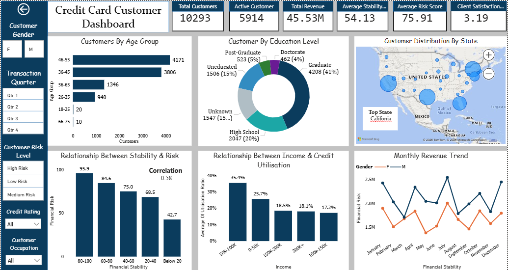
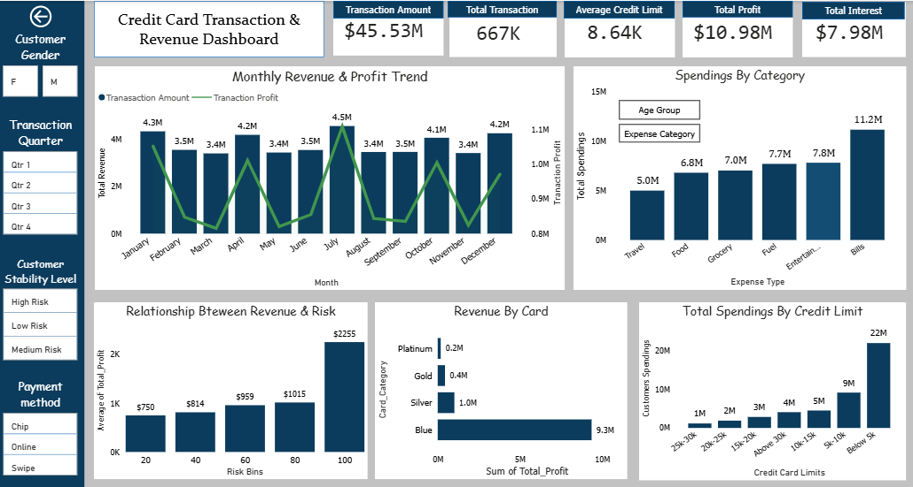

# Credit Card Dashboard

## 1. Credit Card Analytics: Customer Risk and Financial Behavior Dashboard
A dynamic, interactive data visualization tool built to analyze credit card customer data—focusing on spending behavior, financial stability, risk segmentation, credit utilization, and customer-level insights for smarter decision-making.

## 2. Project Purpose
The Credit Card Analytics Dashboard is an interactive Power BI report designed to analyze customer financial behavior, credit usage, and risk patterns through a clear and structured visual experience. It exists to help analysts and decision-makers identify high-risk customers, understand spending and repayment trends, analyse the factor affecting revenue and support smarter credit-related business decisions.

## 3. Tech Stack
| Tools | Use Case |
|------------|----------|
| Power BI Desktop | Used to build the complete interactive dashboard and visual reports. |
| Power Query | Used for cleaning, transforming, and preparing raw data before analysis. |
| DAX (Data Analysis Expressions) | Used to create calculated columns, measures, KPIs, and business logic. |
| Microsoft Excel | Used for initial data formatting and basic data structuring before loading into Power BI. |
| Data Modeling & Relationships | Used to connect multiple tables and build a structured data model for accurate analysis. |
| Interactive Filters & Slicers | Used to make the dashboard dynamic and allow users to filter data for deeper insights. |

## 4. PowerBI Measures
1. **Financial Stability Score-** The Financial Stability Score is a metric used to evaluate the overall financial health of the each customer.Company can use this metrics to make smarter decisions in credit approval, customer targeting, and risk management.
  - **DAX**: Financial_Stability_Score = Financial_Stability[Income_score] + Financial_Stability[Asset Score] + Financial_Stability[Behaviour Score]. 

2. **Financial Risk Score-** The Financial Risk Score represents the likelihood of a customer facing financial difficulty in managing their credit obligations.It can be used to classify customers into different risk categories, enabling businesses to assess creditworthiness, reduce default risk and balance the risk and profit.
- **DAX**: Risk_Score = Financial_Risk[Utilization_score] + Financial_Risk[Debt_Score] + Financial_Risk[Income_Score] + Financial_Risk[Payment_behaviour]

3. **Per Dependent Income-** Per Dependent Income represents the amount of income available for each dependent in a customer’s household. It shows how income is distributed across dependents and helps understand the customer’s financial burden.
  - **DAX:** Per_dependent_income = Round(customer[Income]/(customer[Dependent_Count]+1),0).

## 5. Dashboard Features
- **Business Problem -** The company spends millions of dollars on marketing campaigns, customer awareness programs, and strategies to increase total spending, yet it still faces challenges in expanding and building a strong presence across different states in North America.As a result, identifying underperforming regions, optimizing strategic efforts, and driving balanced market expansion becomes a major challenge. 

- **Goal Of Dashboard -** To provide a clear view of customer spending behavior, financial risk, and regional performance across North America.It helps the business track key metrics, identify growth opportunities, and support data-driven decisions for better customer targeting, risk control, and market expansion.
- **Walkthrough of Key Visuals-**
  - **Key KPIs:** Total Revenue(45.5M), Total transactions(667k), Total Customers(10293), Active(5914), Client Feedback(3.19), Risk Score(75.9/100)etc.
  - **Customer Distribution by State (Map Visual)-** Map visual shows how customers are distributed across different states in North America.
  - **Monthly Revenue & Profit Trend (Combo Chart)** It displays monthly transaction revenue and profit trend together to track business performance over time.
  - **Spendings by Category (Bar Chart)** It breaks down customer spending across major expense categories such as bills, entertainment, fuel, and food.
  - **Total Spendings by Credit Limit (Column Chart)** Shows how customer spending varies across different credit limit, helps assess spending behavior over different credit limit.
  - **Relationship Between Stability & Risk (Column Chart)** It compares customer financial stability group with their corresponding risk scores. It helps reveal how risk changes 
      across different stability levels.
- **Business Impact & Insights**
  - **Sales & Profit** Customer spending tends to peak around the middle of each month, showing a consistent spending pattern. There is also a strong positive correlation of nearly 0.8 between total customer spending and company profitability. Overall, the company generated $11.2M profit this year, with 72% of it coming directly from customer interest.
  - **Customers** The customer base is largely concentrated in the 36–55 age group, which accounts for nearly 80% of total customers, while female customers make up 58% of the portfolio. Only 57% of customers have activated their credit cards, indicating a sizable inactive segment, and nearly half of the users belong to the middle-income group earning between 50K and 100K. In addition, high-risk customers hold a major share of the total customer base.
  - **Risk Analysis** The middle-income segment (50K–100K) shows the highest credit utilization, reaching nearly 40%, which indicates stronger credit usage within this group. The analysis also suggests that the risk factor is closely linked to financial stability, as customers with higher stability tend to consume and use credit more actively.
  - **Spendings & Transaction** Customers spent $11.2M of their total spending on bill payments, making it the highest spending category. At the same time, nearly 70% of customers prefer the swipe method for making payments, showing it is the most commonly used payment option.

## 6. Conclusion
The Credit Card Dashboard provides a clear overview of customer spending patterns, revenue contribution, and credit usage behavior. It helps identify key trends such as payment preferences, spending distribution, and the relationship between credit limits and customer activity.

## 7. Author
**Saransh Goyal**  
**Email:** goyalsaransh61@gmail.com  
**LinkedIn:** [linkedin.com/in/saranshgoyal007](https://www.linkedin.com/in/saranshgoyal007/)  
**GitHub:** [github.com/Saransh3041](https://github.com/Saransh3041)

## 8. Screenshot 

